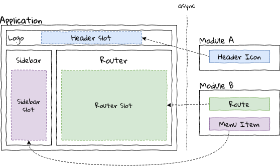

# react-view-slot

`react-view-slot` is a small utility library that allows you to render inside another component space within same react component tree.
Allowing for more modular approach in your applications.


## Table of Contents

 - [Installation](#installation)
 - [Requirements](#requirements)
 - [Overview](#overview)
   - [Slots](#slots)
   - [Plugs](#plugs)
   - [Use cases](#use-cases)
 - [FAQ](#faq)
 - [Features](#features)
 - [Getting Started](#getting-started)
   - [Basic usage](#basic-usage)
   - [Parameters](#parameters)
   - [Non-view slots](#non-view-slots)
 - [API](#api)
 - [License](LICENSE.md)


## Installation

Install using your package manager:

```
npm install --save react-view-slot

yarn add react-view-slot
```

## Requirements

`react-view-slot` uses React Hooks, and thus requires `react >= 16.8`.

## Overview



`react-view-slot` provides you with a notion of a `Slot` and a `Plug`.

### Slots

Slot is a named place where other components can mount to.
Slots can then configure how the
registered plugs are rendered.
A single slot can have more than one plug or none at all.

Slots can also provide parameters to plugs, such as current user or any other contextual information.

### Plugs

Plugs are the connections to the named slot. A single plug can connect only to a single slot.

Plugs are not only limited to render a React element, they can, for example return a JS object to slot.

### Use cases

Using slots is very useful if you want to have better separation of concerns, have dynamic bundles or
simply want to have a modular design.

## FAQ

 - __Does it work with Redux/MobX?__

   `react-view-slot` is completely store-agnostic.

   One thing you should keep in mind is the store-coupling when splitting your application.
   Other than that, your plugs are inside the same react tree as the store providers,
   so there should be no problem using the store from plugs.

## Features

 - Written in TypeScript with type-safe API
 - Lightweight (~120 LoC uncompressed JS)
 - Flexible - you can use slots for anything from Views to Menu items


## Getting started

### Basic usage

`react-slot-view` use React context under the hood, therefore a provider is required to work.

```typescript jsx
import { SlotProvider } from 'react-view-slot';

const Application = () => (
  <SlotProvider>
    {/*your application*/}
  </SlotProvider>
);
```

After adding the provider, create a pair of `Slot` and `Plug` components.
To do this you can use `createSlotAndPlug` function:

```typescript jsx
import {createSlotAndPlug} from 'react-view-slot';

// Create a pair of slot and plug
const [HeaderSlot, HeaderPlug] = createSlotAndPlug('header');

const MainPage = () => (
  <div>
    {/* can be in another component */}
    <HeaderSlot />

    {/* can be in another component */}
    <HeaderPlug id="example">
      <p>Hello from plug</p>
    </HeaderPlug>
  </div>
);
```

> You can also create a slot component using `createSlot(name)` function.
> To connect to created slot you can use `<YourSlot.Plug>` component.


### Parameters

Your slots can pass parameters object to plugs.
Structure of params object can be passed to `createSlotAndPlug` and `createSlot` functions as a type parameter.

```typescript jsx
interface ASlotParams {
  id: number;
}

const [ASlot, APlug] = createSlotAndPlug<ASlotParams>('a');
```

Pass parameters using `params` props on Slot component:

```typescript jsx
<ASlot params={{id: 5}} />
```


Then, to receive parameters from plugs, use render function:

```typescript jsx
<APlug id="example">
 {params => (<span>id: {params.id}</span>)}
</APlug>
```

To customize parameters for each plug, pass render function to Slot component:

```typescript jsx
<ASlot>
  {plugs => (
    <React.Fragment>
      {plugs.map((Plug, index) => (
        <Plug key={Plug.id} id={index} />
      ))}
    </React.Fragment>
  )}
</ASlot>
```

### Non-view slots

You can create a slot that requires plugs to return object of specified type (not only a react view).
To do this, you can expected type as a second template argument to `createSlotAndPlug` and `createSlot` functions.

For example, to create a customizable user-dropdown menu item slot:

```typescript jsx
// user affected
interface UserDropdownSlotParams {
  selectedUser: User;
}

// e.g. a menu item
interface UserDropdownSlotResult {
  name: string;
  icon: string;
  onClick: () => void;
}

const [UserDropdownSlot, UserDropdownPlug] = createSlotAndPlug<UserDropdownSlotParams, UserDropdownSlotResult>('userdropdown');
```

Then, pass render function to slot to get plug result and create menu item:

```typescript jsx
<UserDropdownSlot>
  {plugs => (
    <React.Fragment>
      {plugs.map(plug => {
        let menuEntry = plug({selectedUser: {name: 'John'}});

        return (
          <Menu.Item key={plug.id} icon={menuEntry.icon} onClick={menuEntry.onClick} />
        );
      })}
    </React.Fragment>
  )}
</UserDropdownSlot>
```


## API


### `<Slot>`

Prop                  | Description
----------------------|-----------------------------------------------
`name={string}`       | Slot name to render.
`maxCount={number?}`  | Limit of plugs to render.
`reversed={boolean?}` | Whenever plugs should be rendered in reverse order.
`params={object?}`    | Object containing parameters to plug

Returned component from `createSlot` and `createSlotAndPlug` is a `<Slot>` component with a bound `name` prop.

### `<Plug>`

__Props__

Prop                  | Description
----------------------|-----------------------------------------------
`slot={string}`       | Slot name to connect to.
`id={string}`         | Unique name of plug.
`name={string?}`      | User-friendly name of plug (can be used by slot for rendering).
`order={number?}`     | Number with requested display order.
`deps={any?}`         | List of object to trigger plug update when changed (similar to `React.useEffect`).
`extra={any?}`        | Any other data that should be kept with plug.

Returned component from `createSlotAndPlug` is a `<Plug>` component with a bound `slot` prop.


### `Plug`

Instance of a plug. When using a slot with custom render function you receive a list of `Plug` objects.

A `Plug` object is a function with additional properties:

Prop                  | Description
----------------------|-----------------------------------------------
`plug.slotName`       | Slot name plug is connected to.
`plug.id`             | Unique name of plug.
`plug.name`           | User-friendly name of plug.
`plug.order`          | Number with requested display order.
`plug.extra`          | Any other data that should be kept with plug.
